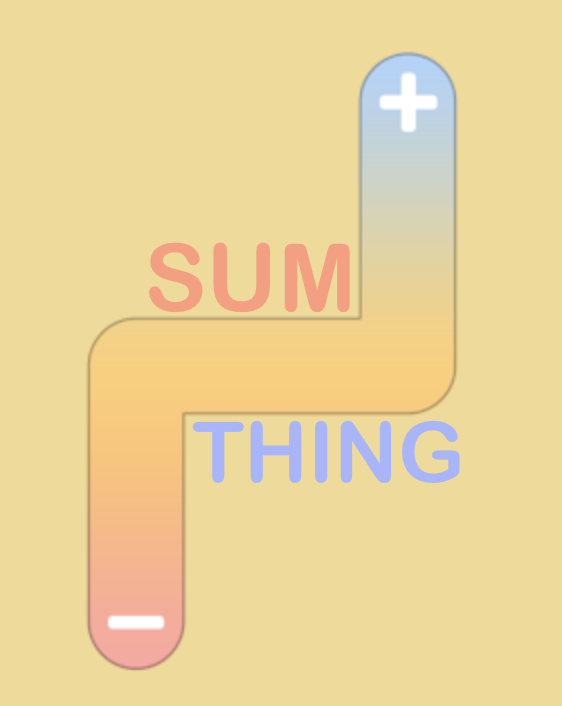

# SumThing
Swift Playground submitted to WWDC 19 (Apple Worldwide Developers Conference).

SumThing is a game to teach basic mathematics operations to children, as well as to improve logical reasoning and skills.

